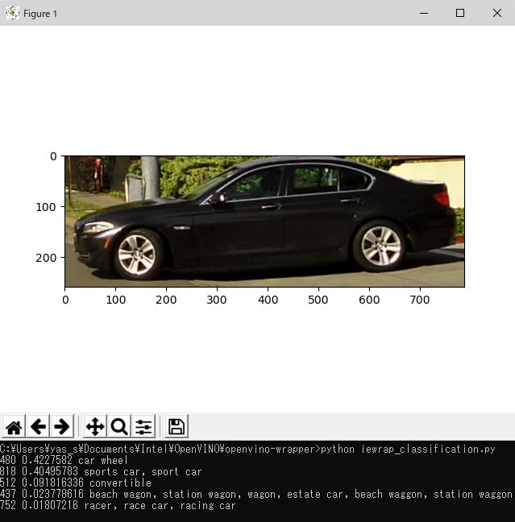
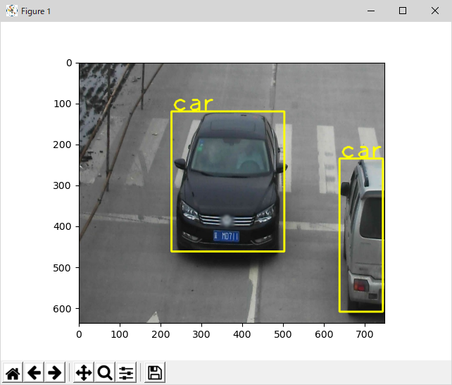
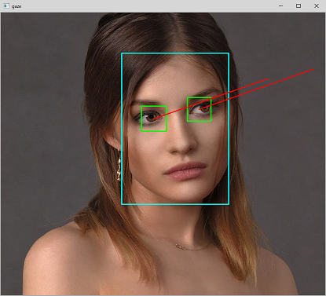

## Overview
This is a tiny Python class library to wrap and abstract the OpenVINO Inference Engine. With this library, user can write a deep-leaning inferencing program easily.  
これはOpenVINOのInference EngineのラッパーライブラリでPythonで書かれています。これを使うことによってディープラーニング推論プログラムを数行で書くことが可能です。

## Description
This library conceals common initialization and processing for OpenVINO Inference Engine. User can write a few lines of code to run deep-learning inferencing with this.  
This library works with Intel Distribution of OpenVINO toolkit. Please make sure that you have installed and setup OpenVINO before try this.   
このライブラリはOpenVINOのInference Engineの共通の初期化処理やデータ処理をまとめてクラス化したものです。ユーザーは数行のコードを書くだけでディープラーニングの推論を行うことが可能です。  
このライブラリはIntel Distribution of OpenVINO toolkit用のライブラリです。OpenVINOをダウンロードしてセットアップをすることが必要になります。

[Intel distribution of OpenVINO toolkit](https://software.intel.com/en-us/openvino-toolkit).

## How easy it is
You can write a simple image classification program like this.  
簡単な画像分類プログラムならこんな感じで記述できます。  
~~~python
import iewrap
import cv2
import numpy as np

label = open('synset_words.txt').readlines()    # Read class label text file
img = cv2.imread('car.png')                     # Read an image to infer

ie = iewrap.ieWrapper('public/googlenet-v1/FP16/googlenet-v1.xml', 'CPU', 4)  # Create an Inference Engine object

output = ie.blockInfer(img)[0]      # Do infer

# Sort class probabilities and display top 5 classes
idx = np.argsort(output)[::-1]
for i in range(5):
    print(idx[i]+1, output[idx[i]], label[idx[i]][:-1])
~~~

## How to use
Sample programs are provided with this library. You can try them to learn how to use this library.
Before you start, you need to install and setup OpenVINO.  
サンプルプログラムが付属しています。これらを実行する前にOpenVINOのインストールとセットアップが必要です。  

1. Go to Intel distribution of OpenVINO toolkit [web page](https://software.intel.com/en-us/openvino-toolkit) and download an OpenVINO package suitable for your operating system
2. Install OpenVINO and setup support tools and accelerators (optional) by following the instruction in ['Get Started'](https://software.intel.com/en-us/openvino-toolkit/documentation/get-started) page
3. Open a command terminal
4. Clone repository to your system
~~~shell
$ git clone https://github.com/yas-sim/openvino-wrapper
~~~
5. Set up environment variables for OpenVINO
~~~
Linux $ source /opt/intel/openvino/bin/setupvars.sh  
~~~
~~~
Windows > call "Program Files (x86)\IntelSWTools\OpenVINO\bin\setupvars.bat"
~~~

6. Download images, class label text files, and deep-learning models using a script (`prep.sh`, or `prep.bat`)
7. Run sample programs  

**`iewrap_classification.py` sample app**  

**`iewrap_object_detection.py` sample app**  
  

**`iewrap_gaze_estimation.py` sample app**  
  

**`iewrap_object_tracking.py` sample app**  
  

## Document

This library supports both blocking (synchronous) inferencing and asynchronous inferencing.  

1. How to import this library
~~~python
import iewrap
~~~

2. API

~~~python
ieWrapper(modelFile=None, device='CPU', numRequest=4)
~~~
- *Description*
 - This function creates a `ieWrapper` object.
- *Input*
 - `modelFile`: Path to an OpenVINO IR format deep-learning model topology file (`.xml`). A weight file (`.bin`) with the same base file name wil be automatically loaded.
 - `device`: Device to run inference. E.g. `CPU`, `GPU`, `MYRIAD`, `HDDL`, `HETERO:FPGA,CPU`. Please refer to the official OpenVINO document for details.
 - `numRequest`: Maximum number of simultaneous inferencing. If you specify 4, you can run 4 inferencing task on the device at a time.  
- *Return*
 - None

~~~python
readModel(xmlFile, binFile, device='CPU', numRequest=4)
~~~
- *Description*
 - This function reads an OpenVINO IR model data. User does not need to use this function when you have read the model data in the constructor (`ieWrapper()`).  
- *Input*
 - `xmlFile`: Path to an OpenVINO IR format deep-learning model topology file (.xml).
 - `binFile`: Path to an OpenVINO IR format deep-learning model weight file (.xml).
 - `device`: Device to run inference. E.g. `CPU`, `GPU`, `MYRIAD`, `HDDL`, `HETERO:FPGA,CPU`. Please refer to the official OpenVINO document for details.
 - `numRequest`: Maximum number of simultaneous inferencing. If you specify 4, you can run 4 inferencing task on the device at a time.  
- *Return*
 - None

~~~python
setInputType(blobName, blobType)
~~~
- *Description*
 - Set the type of a input blob. The default type is `'image'`. If the data type you supply is non-image data, you need to set the blob type to other one such as `'vec'`. The type is just a string and this library just cares if it's `'image'` or not. If the type is `'image'`, the blob data will go through image preprocess before inferencing (resize and transform).
- *Input*
 - `blobName`: Name of the blob to set the type
 - `blobType`: A string. `image` or others
- *Output*
 - None   

~~~python
1. outBlob = blockInfer(ocvImg)     # for single input model
2. outBlob = blockInfer(inputDict)  # for multiple input model
~~~
- *Description*
 - Start blocking (synchronous) inferencing. The control won't back until the inference task is completed. You can immediately start processing the result after this function call. Blocking inferencing is easy to use but not efficient in terms of computer resource utilization.
- *Input*
 - `ocvimg`: OpenCV image data to infer. The image will be resized and transformed to fit to the input blob of the model. The library doesn't swap color channels (such as BGR to RGB). You can use this style of API when your model has single input.
 - `inputList`: List of input blob information which is created by `getInputs()` API function. 
   - You can obtain the input list with `getInputs()` and stuff your input data to infer to `data` element in the dictionary in the list.
   - The default blob type is `'image'`. You must set appropriate blob type before you start inferencing with `setInputType()` API. If the blob type is `'image'`, the blob data is considered as an OpenCV image data and go through image preprocessing before inferencing (resize and transform), otherwise the blob data in will be just passed to the Inference Engine without any preprocessing.
   - You must use this style of API when your model has multiple inputs. 
   - e.g. `{ 'data' : data, 'data1' : data1 }`
- *Return*
 - `outBlob`: Output result of the inferencing
  - Single output model: `outBlob` contains the data of the output blob.
  - Multiple output model: `outBlob` contains a dictionary which contains the outputs of the model.
    - Key: The name of an output blob
    - Value: The contents of an output blob
    - e.g. `{ 'prob' : data }`

~~~python
1. infID = asyncInfer(ocvimg)     # for single input model
2. infID = asyncInfer(inputDict)  # for multiple input model
~~~
- *Description*
 - Start asynchronous inferencing. Set a callback function before you call this function or the inferencing result will be wasted.
- *Input*
 - `ocvimg`: OpenCV image data to infer. The image will be resized and transformed to fit to the input blob of the model. The library doesn't swap color channels (such as BGR to RGB). You can use this style of API when your model has single input.
 - `inputList`: List of input blob information which is created by `getInputs()` API function. 
   - You can obtain the input list with `getInputs()` and stuff your input data to infer to `data` element in the dictionary in the list.
   - The default blob type is `'image'`. You must set appropriate blob type before you start inferencing with `setInputType()` API. If the blob type is `'image'`, the blob data is considered as an OpenCV image data and go through image preprocessing before inferencing (resize and transform), otherwise the blob data in will be just passed to the Inference Engine without any preprocessing.
   - You must use this style of API when your model has multiple inputs. 
   - e.g. `{ 'data' : data, 'data1' : data1 }`
- *Return*
 - `infID`: ID number of the requested inferencing task

~~~python
setCallback(callback)
~~~
- *Description*
 - Set a callback function which will be called after completion of each asynchronous inferencing.
- *Input*
 - `callback`: Name of the callback function. The callback function will receive 1 tuple parameter. The tuple consists of `infID` and `outBlob` `(infID, outBlob)`. You can check the inference result with `outBlob` and identify the reuslt is for which inference request by the `infID`.
  - The contents of the `outBlob` varies depend on the number of outputs of the model.
    - Single output model: The `outBlob` contains the contents of the output Blob.
    - Multiple output model: `outBlob` contains a dictionary which contains the outputs of the model.
      - Key: The name of an output blob
      - Value: The contents of an output blob
    - e.g. `{ 'prob' : data }`
- *Return*
 - None
 
~~~python
dict = getInputs()
~~~
- *Description*
 - Return a dictionary which represents the input of the model you have loaded.
- *Input*
 - None
- *Output*
 - Information of the input blobs of the loaded model in a dictionary.
 - The dict format is: `{ blobName : { 'data':blobData, 'shape':blobShape, 'type':blobType }, ... }`.
   - `blobType` is a string. The value can be `image`, or others. If the type is `image`, the `blobData` will go through image preprocess before inferencing.

~~~python
dict = getOutputs()
~~~
- *Description*
 - Return a list of dictionary which represents the output of the model you have loaded.
- *Input*
 - None
- *Output*
 - Information of the output blobs of the loaded model in a dictionary.
 - The dict format is: `{ blobName : { 'shape':blobShape }, ... }`.   

## Requirement
This workshop requires [Intel distribution of OpenVINO toolkit](https://software.intel.com/en-us/openvino-toolkit).

## Contribution

## Licence

[Apache2](http://www.apache.org/licenses/LICENSE-2.0.txt)

## Author

[Yasunori Shimura](https://github.com/yassim-intel)
